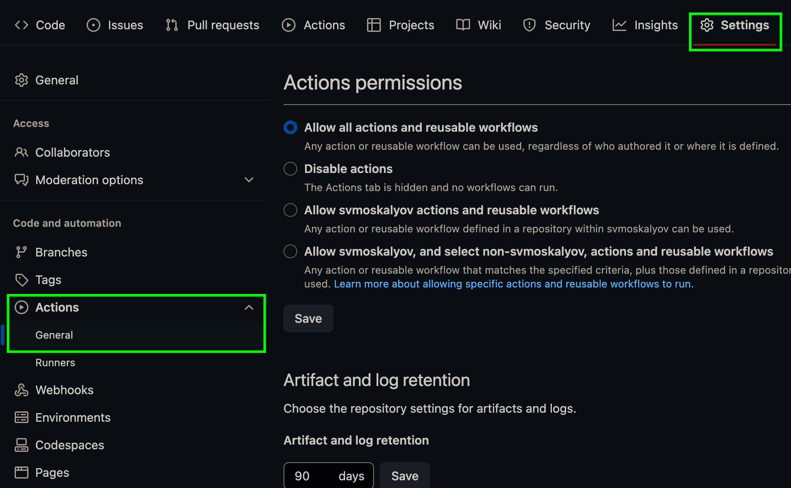

# React template

This project was bootstrapped with
[Create React App](https://github.com/facebook/create-react-app).

## Create a repository from a template

Use this repository as a template for creating a repository your project. To do
this, click on the `"Use this template"` button and select the option
`"Create a new repository"` as shown in the image.


The next step will open the page for creating a new repository. Fill in the
field his name, make sure that the repository is public, then click the button
`"Create repository from template"`.


After the repository is created, you need to go to the settings created
repository to `Settings` > `Actions` > `General`



After scrolling to the very bottom of the page, in the `"Workflow permissions"`
section, select option `"Read and write permissions"` and check the checkbox.
This necessary to automate the project deployment process.


## Preparing for work

1. Make sure you have an LTS version of Node.js installed on your computer.
   [Download and install](https://nodejs.org/en/) if needed.
2. Install the basic project dependencies with the `npm install` command.
3. Start development mode by running the `npm start` command.
4. Go to [http://localhost:3000](http://localhost:3000) in your browser. This
   page will automatically reload after saving changes to project files.

## Deploy

The production version of the project will be automatically linted, built and
deploy to GitHub Pages, in the `gh-pages` branch, every time it is updated
branch `main`. For example, after a direct push or an accepted pull request. For
this you need to edit the `homepage` field in the `package.json` file, replacing
`your_username` and `your_repo_name` with your own, and push the changes to
GitHub.

```json
"homepage": "https://your_username.github.io/your_repo_name/"
```

Next, you need to go to the settings of the GitHub repository (`Settings` >
`Pages`) and set the distribution of the production version of files from the
`/root` folder of the `gh-pages` branch, if this was not done automatically.


### Deployment status

The deployment status of the latest commit is displayed with an icon next to its
ID.

- **Yellow color** - the project is being built and deployed.
- **Green color** - deployment completed successfully.
- **Red color** - an error occurred during linting, build or deployment.

More detailed information about the status can be viewed by clicking on the
icon, and in drop-down window to follow the link `Details`.

### Routing

If the application uses the `react-router-dom` library for routing, you need to
additionally configure the `<BrowserRouter>` component by passing in the prop
`basename` is the exact name of your repository. The slash at the beginning of
the line is required.

```jsx
<BrowserRouter basename="/your_repo_name">
  <App />
</BrowserRouter>
```

## How it works

1. After each push to the `main` branch of the GitHub repository, a special
   script (GitHub Action) from `.github/workflows/deploy.yml` file.
2. All repository files are copied to the server where the project is
   initialized and passes linting and assembly before deployment.
3. If all steps were successful, the assembled production version of the project
   files goes to the `gh-pages` branch. Otherwise, in the execution log The
   script will indicate what the problem is.
